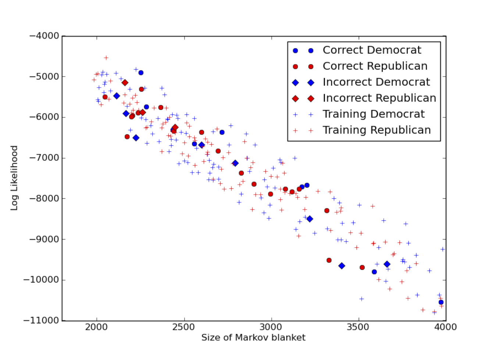

.. |probrem| replace:: **P**\ rob\ **R**\ e\ **M**   

.. _example_model:

Example model
=================

Model Description
------------------------

In the United States, running a political campaign to be elected into Congress is an expensive endeavour. The amount of money at the disposal of a candidate is an important factor in a successful campaign. Recognizing this influence and the problems that come with it - corrupt lobbying, vested corporate interests - the recipient of a political contribution is required by law to report the donation. As a consequence of the recent trend towards government transparency and data digitalization, this data is now publicly available for bulk `download <http://www.transparencydata.com>`_.

Recipients of political contributions are required by law to report details about each donation they receive. The domain is suitable for modelling using PRMs. The figure below shows our example model. The set of entities is :math:`\mathcal{E} =\{ {\mathit{Recipient}},{\mathit{Contributor}},{\mathit{State}} \}` and the set of relationships :math:`\mathcal{R}` contains the relationship :math:`\mathit{Donation}`. The linked entities of :math:`\mathit{Donation}` are :math:`R(\mathit{Recipient}, \mathit{Contributor},\mathit{State})` and every donation object :math:`d \in \sigma_{\mathcal{R}}(\mathit{Donation})` has a attribute object :math:`d.\mathit{Amount}`.

There is a probabilistic dependency between the :math:`a = \mathit{Amount}` attribute of the :math:`\mathit{Donation}` relationship and the :math:`cat = \mathit{Category}` attribute associated with the :math:`\mathit{Contributor}` entity. The constraint :math:`\mathcal{C}_{{\text Amount,Category}}` will activate the dependency only between :math:`\mathit{Contributor}` objects for which the :math:`\mathit{Donation}` object is intended (:math:`\mathit{contributor[Category]}=\mathit{contributor[Amount]}`). Similar dependencies exist for :math:`dem_{rec} = \mathit{Recipient.Democratic}`, :math:`dem_{state} = \mathit{State.Democratic}` and :math:`inc = \mathit{State.Income}`. Thus the shared local distribution of the amount is :math:`P({\mathit{a}}\mid{\mathit{cat}},{\mathit{dem_{rec}}},{\mathit{dem_{state}}},{\mathit{inc}})`.

The Data 
--------------------------------

In order to model the data with a PRM, we considered a subset of the data, consisting of the federal contributions for the cycle 2007-2008.  The recipients are either individuals running for Congress (House or Senate), Political Action Committees (PACs) or presidential candidates (Barack Obama, John McCain). To guarantee statistical significance, only recipients who received more than 1000 contributions are included in the model. The political affiliation of candidates for Congress is easily available. PACs on the other hand usually redistribute their donations to candidates of both parties, which makes it harder to determine their affiliation. Each contributor is associated with a name, the US state where the donation was made, and a industry category (e.g. Oil \& Gas, Gun Rights, Retired). The size of the dataset and the cardinality of the attributes are displayed in  Table below.  We augmented the data with information about the contributor state: a binary variable indicating the income level (above or below the US average) and a binary variable for the political affiliation of the state based on the outcome of the previous presidential election. 

After the data is curated, e.g. only recipients with a minimum number of contributions and the `amount` needs to discretized into reasonable bins. The data is stored in a SQLite database './data/policont.sqlite' based on the following schema::

    -- ENTITIES
    DROP TABLE IF EXISTS Recipient;
    CREATE TABLE Recipient
    (
    recipient_id INTEGER PRIMARY KEY,
    political_id INTEGER NOT NULL,
    recipient_democratic INTEGER,
    recipient_name CHAR(255) NOT NULL
    );
    DROP TABLE IF EXISTS Contributer;
    CREATE TABLE Contributer
    (
    contributer_id INTEGER PRIMARY KEY,
    industry INTEGER
    );
    DROP TABLE IF EXISTS Political;
    CREATE TABLE Political
    (
    political_id INTEGER PRIMARY KEY,
    state_name CHAR(255) NOT NULL,
    income INTEGER,
    democratic INTEGER
    );
    -- RELATIONSHIPS
    DROP TABLE IF EXISTS donation;
    CREATE TABLE donation
    (
    donation_id INTEGER PRIMARY KEY,
    recipient_id INTEGER NOT NULL,
    contributer_id INTEGER NOT NULL,
    contributer_political_id INTEGER NOT NULL,
    amount INTEGER NOT NULL,
    FOREIGN KEY (recipient_id) REFERENCES Recipient(recipient_id),
    FOREIGN KEY (contributer_id) REFERENCES Contributer(contributer_id),
    FOREIGN KEY (contributer_political_id) REFERENCES Political(political_id)
    );

Data Interface Specification
--------------------------------

The specification file './poliContDI.xml' is straight forward.  ::

    <?xml version="1.0"?>
    <DataInterface name="PoliContDI">
    	<Crossvalidation folds='1'>		
    		<Dataset type='SQLite' path='./data/policont.sqlite'/>
    	</Crossvalidation>
    </DataInterface>

For this model we created different SQlite databases for the test and training set. Then the model parameters were learned using the training DB and the same PRM model was loaded with test DB for inference. This is done by hand, thus the number of `folds` is just 1.

PRM Specification
------------------------

The PRM specification file './poliContPRM.xml' must use the same names as the database schema above. ::

    <?xml version="1.0"?>
    <PRM name="PoliContPRM"  datainterface="poliContDI.xml"  >
    	<RelationalSchema>
    		<Entities>
    			<Entity name="Recipient">
    				<Attribute name="recipient_democratic" type="Binary"/>
    			</Entity>
    			<Entity name="Contributer">
    				<Attribute name="industry" type="Integer" description="1,115"/>
    			</Entity>
    			<Entity name="Political">
    				<Attribute name="democratic" type="Binary"/>
    				<Attribute name="income" type="Binary"/>
    			</Entity>				
    		</Entities>
    		<Relationships>
    			<Relationship name="donation" foreign="Recipient.pk,Contributer.pk,Political.pk:contributer_political_id" type="m:n">
    				<Attribute name="donation_id" pk='1' type="NotProbabilistic"/>
    				<Attribute name="amount" type="Integer" description="1,20"/>
    			</Relationship>				
    		</Relationships>
    	</RelationalSchema>	
    	<DependencyStructure>
    		<Dependency name="political_dem_amount" parent="Political.democratic" child="donation.amount" constraint="Political.political_id=donation.contributer_political_id"/>
    		<Dependency name="income_amount" parent="Political.income" child="donation.amount" constraint="Political.political_id=donation.contributer_political_id"/>
    		<Dependency name="recipient_dem_amount" parent="Recipient.recipient_democratic" child="donation.amount" constraint="Recipient.recipient_id=donation.recipient_id"/>	
    		<Dependency name="industry_amount" parent="Contributer.industry" child="donation.amount" constraint="donation.contributer_id=Contributer.contributer_id"/>
    	</DependencyStructure>	
    	<LocalDistributions>		
    		<LocalDistribution attribute='Political.democratic' file='./localdistributions/democratic.xml'/>
    		<LocalDistribution attribute='Political.income' file='./localdistributions/income.xml'/>
    		<LocalDistribution attribute='Contributer.industry' file='./localdistributions/industry.xml'/>
    		<LocalDistribution attribute='Recipient.recipient_democratic' file='./localdistributions/recipient_democratic.xml'/>
    		<LocalDistribution attribute='donation.amount' file='./localdistributions/amount_recipient_democraticcontributer_id.xml'/>
    	</LocalDistributions>	
    </PRM>

|probrem| Project
------------------------

The python script './poliCont.py' initializes a |probrem| project::

    import sys
    # interactive iPython console is used to interact with a probrem project
    from IPython.Shell import IPShellEmbed
    ipshell = IPShellEmbed()

    # add the relative or absolute path to the 'Probrem/src' folder
    sys.path.append("../../src")
    #sys.path.append("/Users/xxxx/Documents/Projects/Probrem/src")

    from probrem import Probrem
    from ui import config

    '''
    the ProbReM instance
    ''' 
    probremI = Probrem()

    ''' PRM '''
    prmSpec = "poliContPRM.xml"    
    probremI.prmI = config.loadPRM(prmSpec)

    ''' DATA INTERFACE '''
    diSpec = probremI.prmI.datainterface
    #diSpec = "poliContDI.xml"
    probremI.diI = config.loadDI(diSpec)
    # Configure data interface with the prm instance
    probremI.diI.configure(probremI.prmI)

    ''' LEARNERS '''
    # Load a cpd learner to learn the CPDs for our attributes          
    probremI.learnersI['ourCPDlearner'] = config.loadLearner('CPDTabularLearner')
    # Configure the learner to use the prm and data interface we instantiated 
    probremI.learnersI['ourCPDlearner'].configure(probremI.prmI,probremI.diI,learnCPDs=False)
    # For ease of use
    ourCPDlearner = probremI.learnersI['ourCPDlearner']

    # Learn all conditional probability distributions from data and save them to disk
    ourCPDlearner.learnCPDsFull(saveDistributions=True,forceLearning=False)

    ''' INFERENCE ENGINE '''
    #we load an inference engine 
    probremI.inferenceI = config.loadInference('MCMC')
    #we configure the engine to use the prm and data interface we instantiated 
    probremI.inferenceI.configure(probremI.prmI,probremI.diI)
    # for ease of use
    mcmcInference = probremI.inferenceI

    # uncomment if you want to interact with the model at this point
    # ipshell()

Using the |probrem| Project
------------------------------------

Create a separate script for using the `poliCont` ProbReM project, e.g. './poliContTesting.py'.
Now we can interact with the model, for example the following code will display all model attributes and their CPDs. ::

    # Load the ProbReM instance
    import poliCont
       
    for a in poliCont.probremI.prmI.attributes.values():
    
        print '%s, probabilistic=%s, Pa=%s'%(a.fullname,a.probabilistic,[pa.name for pa in a.parents])
        if a.probabilistic:
            print a.CPD.cpdMatrix

To infer the political affiliation of Rahm Emanuel for example, create the following query. ::

    # Load the ProbReM instance
    import poliCont

    from inference.query import Query, createQvar,ObjsVariable
    from inference import posterior

    recipient = "Rahm Emanuel (D)"
    rec_pk = static_data.recipients[recipient] # a dictionary mapping politians to their primary key

    objs = ObjsVariable('incl', rec_pk)
    event = [ createQvar('Recipient.recipient_democratic',objs)]

    objsAll = ObjsVariable('excl', [])
    evidence = [    createQvar('donation.amount',objsAll,None), 
                    createQvar('Contributor.industry',objsAll,None), 
                    createQvar('Political.democratic',objsAll,None), 
                    createQvar('Political.income',objsAll,None)]

    query = Query(event,evidence)

    # Runs one chain using the current settings in `inference.mcmc` 
    poliCont.probremI.inferenceI.infer(query)

    # Check the convergence using the cumulative mean
    posterior.cumulativeMean()
    
    # Print the mean of the posterior distribution
    print posterior.mean()[0]
    
    # The log likelihood of Rahm Emanuel
    loglik = poliCont.probremI.inferenceI.GBN.logLikelihood()
    # The size of the GBN required for inference on Rahm Emanuel
    sizeGBN = len(poliCont.probremI.inferenceI.GBN)
        
    # Interactive iPython session for further analysis
    poliCont.ipshell()
    
If we run inference for every recipient in our test set, we can measure the accuracy of predicting the political affiliation using the political contributions received. Below three example plots which can be generated without much effort.

    Shows the cumulative mean of three chains; the chain seems to mix at around 800 samples. 

    A scatter plot of the size of the Markov blanket and the log likelihood of the recipient. The red and blue colours indicate republican and democratic affiliations respectively. A circle means the recipient has been correctly classified whereas a diamond indicates a misclassification.

    A more involved plot showing the ratio between the log-likelihood `loglik` and the size of the Markov blanket `sizeGBN` for all recipients in the dataset. By “normalizing” the log-likelihood by the number of nodes in the Markov blanket, we obtain scaled values for each recipient, which are more directly comparable. The mean of the democratic and republican recipients is similar, but the democratic recipients display a higher variance.
    

Remarks
------------

This model was used in `An Approach to Inference in Probabilistic Relational Models using Block Sampling` by Kaelin et al. (see :ref:`Publications<publications>`).
Because of the size of the data and the complexity of the steps involved (e.g. curating the data, fiddling with the parameters), it is not reasonable to provide executable code here. Please `contact`_ us if you are interested in  using |probrem| and would like more assistance. 

.. _contact: fabian.kaelin\@mail.mcgill.ca
