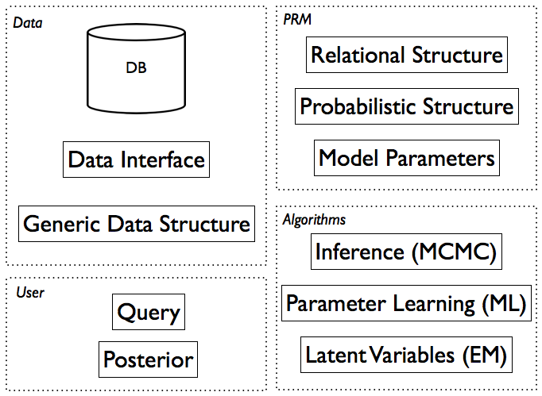

.. |probrem| replace:: **P**\ rob\ **R**\ e\ **M**  

.. _using_probrem:

Using |probrem| 
=====================

.. _overview:

Overview
----------------

    |probrem| framework structure

The illustration above shows the structure between the |probrem| packages and modules. The :ref:`Modelling Workflow<modelling_workflow>` section below is a walk through for designing a new model we call *PRMexample*. Please refer to the tutorial in the :ref:`Example Model<example_model>` for details.

.. _modelling_workflow:

Modelling Workflow
-------------------------

A |probrem| project is a python script used to specify a PRM, connect it to database and configure the algorithms that will be used. The last :ref:`section<probrem_project>` describes the structure of such a script.

Data
^^^^^^^^^^^^^^^^^^

The data itself is stored in a separate relational database, |probrem| accesses the data using a :mod:`data.datainterface` which makes the choice of database irrelevant (theoretically). Currently |probrem| supports the `SQLite <www.sqlite.org>`_  format which is implemented in :class:`data.sqliteinterface.SQLiteDI`.  

Assuming the data is stored in *./data/database.sqlite*\ , a data interface specification is defined in XML and saved in the file *./DIexample.xml*::

    <?xml version="1.0" ?>
    <DataInterface name="DIexample">
    	<Crossvalidation folds='1'>		
    		<Dataset type='SQLite' path='./data/database.sqlite'/>
    	</Crossvalidation>
    </DataInterface>

Which is a simple example where just one data source is specified. It is also possible test the model using cross validation by specifying multiple data sources, in which case the data has to be split up on the database level. Otherwise the different folds would have to be accessed by querying one database which decreases the performance. The XML parser for the data interface :class:`xml_prm.parser.DataInterfaceParser` contains the specifications for the tags. 

The *Ground Bayesian Network* (GBN) is a generic data structure (a graph) that contains the data necessary to answer a given query. The GBN is stored in propositional form, as opposed to the first-order representation of the PRM, thus only the subgraph which d-separates the full graph given the query is loaded.
The :mod:`network.groundBN` module implements this data structure. The inference engine is loading the GBN using the method :meth:`inference.engine.unrollGBN`.

PRM specification
^^^^^^^^^^^^^^^^^^

The PRM model is also specified in XML and saved in the file, e.g. *./PRMexample.xml*::

    <?xml version="1.0" ?>
    <PRM name="PRMexample"  datainterface="./DIexample.xml" >
    	<RelationalSchema>
    		<Entities>
    			<Entity name="A">
    				<Attribute name="Aa" type="Binary"/>
    			</Entity>			
    			<Entity name="B">
    				<Attribute name="Ba" type="Integer" description="1,20"/>
    			</Entity>		
                [......]
    		</Entities>
    		<Relationships>
    			<Relationship name="AB" foreign="A.pk,B.pk" type="1:n">
    				<Attribute name="ABa" type="Binary"/> 
    			</Relationship>				
    			[......]
    		</Relationships>
    	</RelationalSchema>	
    	<DependencyStructure>			
    		<Dependency name="Aa_Ba" child="A.Aa" parent="B.Ba" constraints="A.pk=B.pk"  aggregator='AVG'/>
    		[......]
    	</DependencyStructure>	
    	<LocalDistributions>
    		<LocalDistribution attribute='A.Aa' file='./localdistributions/Da_Aa.xml'/>
    		<LocalDistribution attribute='B.Ba' file='./localdistributions/Ba_Aa.xml'/>
    		<LocalDistribution attribute='AB.ABa' file='./localdistributions/Ca_Aa.xml'/>
    	</LocalDistributions>	
    </PRM>

A list of all possible tags as well as attributes, please see the documentation of the XML parser :class:`xml_prm.parser.PRMparser` used by |probrem|. The PRM is defined by the relational structure *<RelationalSchema>*, probabilistic structure (*<DependencyStructure>*) and the model parameters (*<LocalDistributions>*\; the conditional probability distributions of the attributes). 

Algorithms
^^^^^^^^^^^^^^^^^^

**Model Parameters**:

Usually the local conditional probability distributions (CPDs) are learned from data. |probrem| uses a Maximum Likelihood (ML) estimate which is implemented in :class:`learners.cpdlearners.CPDTabularLearner`. Currently only tabular CPDs are supported, :class:`prm.localdistribution.CPDTabular`. The learner instance can be configured to save the distributions to a file, the necessary files will be created automatically and the parser loads the distributions from disk if a corresponding file is available.

.. REMARK: In complex models, e.g. in case attributes have a large number of parents, this doesn't scale well; another approach would be to implementing the class :class:`prm.localdistribution.CPDTree`, a CPD based on a decision tree. 

**Inference**:

All inference methods in |probrem| are based on *Markov Chain Monte Carlo* methods. MCMC has proven to be very efficient, unfortunately MCMC algorithms in practice require a lot of fiddling around with parameters, e.g. burn in, number of samples collected, proposal distribution, convergence diagnostics. Depending on the type of query, different algorithms with different parameters are necessary. For this reason a |probrem| project has to allow a flexible configuration of the inference method. More complex models may also require custom proposal distributions. The :mod:`inference` module offers the framework for MCMC inference, please refer to the documentation for details.

.. _probrem_project:

|probrem| Project
^^^^^^^^^^^^^^^^^^

A python script is used to configure a |probrem| project::

    probremI = Probrem()

    ''' PRM '''
    prmSpec = "PRMexample.xml"    
    probremI.prmI = config.loadPRM(prmSpec)

    ''' DATA INTERFACE '''
    diSpec = probremI.prmI.datainterface
    #diSpec = "DIexample.xml"
    probremI.diI = config.loadDI(diSpec)
    #configure datainterface with the prm instance
    probremI.diI.configure(probremI.prmI)

    
Next, the local distributions are learned from data. If the probabilistic structure and the data don't change, the CPDs can be loaded from disk the next time the `PRMexample` model is instantiated. ::

    ''' LEARNERS '''
    #we load a cpd learner to learn the CPDs for our attributes          
    probremI.learnersI['ourCPDlearner'] = config.loadLearner('CPDTabularLearner')
    #we configure the learner to use the prm and data interface we instantiated 
    probremI.learnersI['ourCPDlearner'].configure(probremI.prmI,probremI.diI,learnCPDs=False)
    
    probremI.learnersI['ourCPDlearner'].learnCPDsFull(saveDistributions=True,forceLearning=True)

After the model parameters are defined the inference method can be configured. The parameters are needed as engine precomputes as much as possible, e.g. the likelihood functions in the case of a Gibbs sampler. ::

    ''' INFERENCE ENGINE '''
    probremI.inferenceI = config.loadInference('MCMC')
    #we configure the engine to use the prm and data interface we instantiated 
    probremI.inferenceI.configure(probremI.prmI,probremI.diI)
    
Assuming that the script is saved in `./probremExample.py`, the model can now be used for queries by creating another script `./queryExample.py` which imports the model specification. A very simplistic example is given below::
    
    from probremExample import *
    
    # creating a query
    exQuery = Query(event,evidence)
    probremI.inferenceI.infer(exQuery) 
    
    # display the cumulative mean to test the convergence
    posterior.cumulativeMean()
    
The :ref:`Example Model<example_model>` includes more details as well as complete source code.
    

    

    

